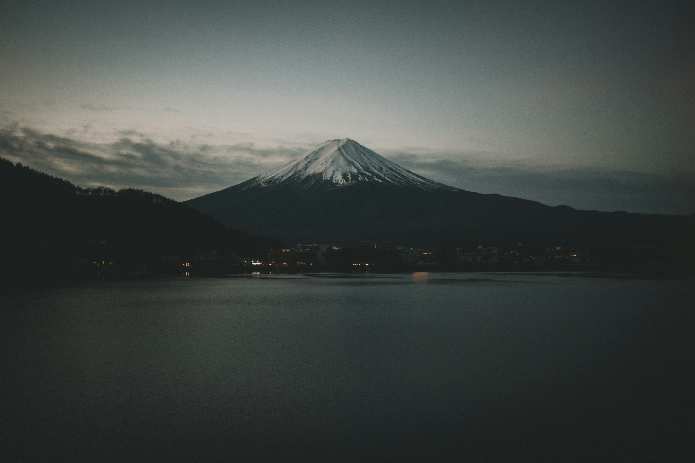
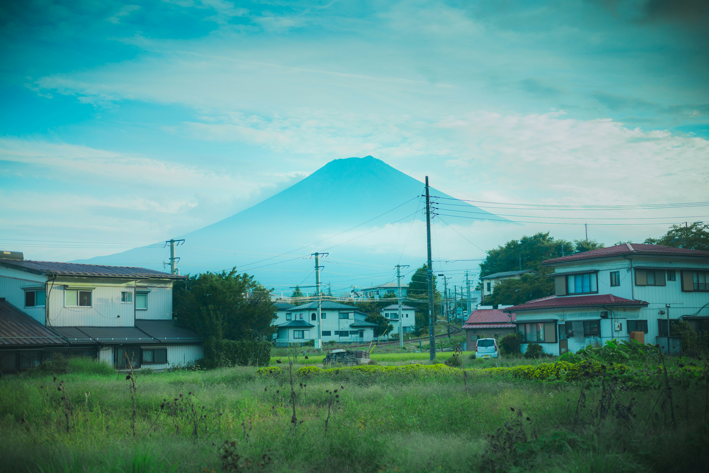
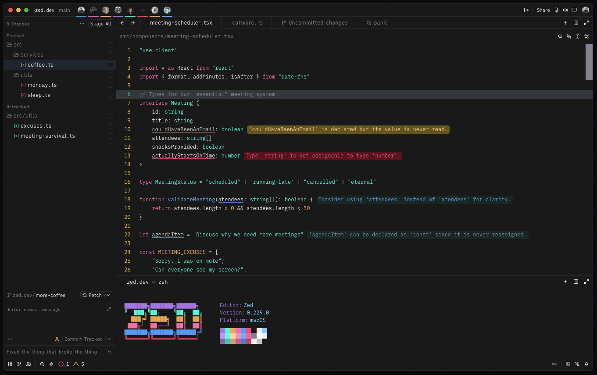
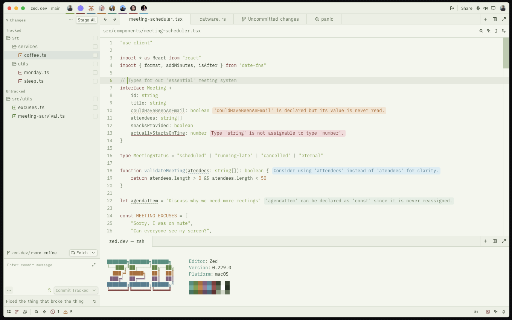
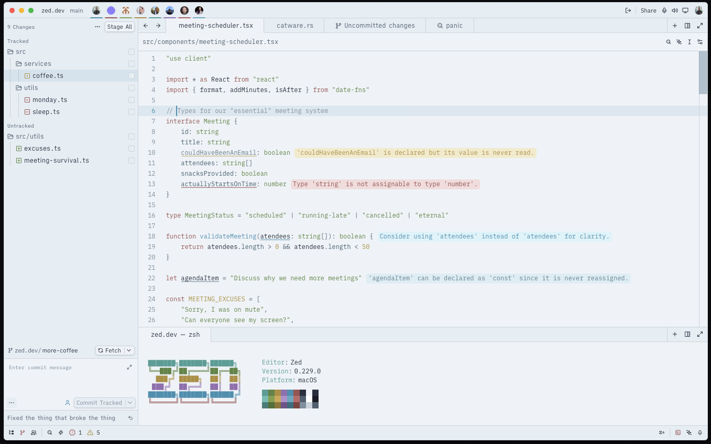

# FujiHaze Theme for Zed

A serene Zed IDE theme inspired by the quiet beauty of Mount Fuji and the peaceful Japanese countryside.

<table>
  <tr>
    <td width="50%" align="center"><b>Dark Theme Reference</b></td>
    <td width="50%" align="center"><b>Light Theme Reference</b></td>
  </tr>
  <tr>
    <td></td>
    <td></td>
  </tr>
  <tr>
    <td align="center"><sub>Mount Fuji at twilight</sub></td>
    <td align="center"><sub>Japanese countryside</sub></td>
  </tr>
</table>

## About the Name

**FujiHaze** combines two elements that capture the essence of this theme:

- **Fuji** - The iconic Mount Fuji, symbol of Japan's natural beauty and tranquility
- **Haze** - The soft mist that often surrounds the mountain, creating an atmosphere of calm and serenity

## Previews

<table>
  <tr>
    <td width="33%" align="center"><b>FujiHaze Dark</b></td>
    <td width="33%" align="center"><b>FujiHaze Countryside</b></td>
    <td width="33%" align="center"><b>FujiHaze Morning Mist</b></td>
  </tr>
  <tr>
    <td></td>
    <td></td>
    <td></td>
  </tr>
</table>

## Theme Variations

### FujiHaze Dark
A deep, calming dark theme with vibrant accents inspired by twilight over rural Japan.

| Role | Color | Hex | Preview |
|------|-------|-----|---------|
| Background | Charcoal | `#1A1A1A` |  |
| Surface | Dark Slate | `#3B3F45` |  |
| Primary Text | Soft White | `#F0F0F0` |  |
| Muted Text | Cool Gray | `#8B8E99` |  |
| Accent (Keywords) | Sakura Pink | `#FF75B5` |  |
| Accent (Functions) | Fuji Blue | `#6FC1FF` |  |
| Accent (Strings) | Wasabi Green | `#19F9D8` |  |
| Accent (Constants) | Amber Field | `#FFB86C` |  |
| Accent (Focus/Border) | Sunset Coral | `#FF4B82` |  |
| Terminal Yellow | Harvest Gold | `#F1AD57` |  |
| Terminal Blue | Sky Blue | `#45A9F9` |  |
| Terminal Magenta | Soft Pink | `#FF75B5` |  |
| Terminal Cyan | Lavender | `#B084EB` |  |

### FujiHaze Countryside
A clean, bright light theme with natural green undertones, evoking the crisp air of rural Japan during midday.

| Role | Color | Hex | Preview |
|------|-------|-----|---------|
| Background | Rice Paper | `#F5F7F0` |  |
| Surface | Pale Sage | `#EEF1E8` |  |
| Primary Text | Deep Forest | `#3D4A35` |  |
| Muted Text | Moss Gray | `#6B7A60` |  |
| Accent (Keywords) | Roof Rust | `#8B4545` |  |
| Accent (Functions) | Slate Blue | `#5A8A9A` |  |
| Accent (Strings) | Bamboo Green | `#8FA855` |  |
| Accent (Constants) | Autumn Gold | `#B87840` |  |
| Accent (Focus/Border) | Moss Green | `#8FA855` |  |
| Terminal Green | Fern | `#6B8E4E` |  |
| Terminal Blue | River Blue | `#6BB3C7` |  |
| Terminal Yellow | Wheat | `#D09050` |  |
| Terminal Red | Brick | `#A85A5A` |  |

### FujiHaze Morning Mist
A soft light theme with cool blue undertones, capturing the gentle atmosphere of early morning fog.

| Role | Color | Hex | Preview |
|------|-------|-----|---------|
| Background | Mist White | `#F0F5F8` |  |
| Surface | Pale Blue | `#E8F0F5` |  |
| Primary Text | Ink Black | `#2D3748` |  |
| Muted Text | Fog Gray | `#5A6B7A` |  |
| Accent (Keywords) | Rustic Red | `#A65D5D` |  |
| Accent (Functions) | Morning Sky | `#4A9BB8` |  |
| Accent (Strings) | Meadow Green | `#6B8E4E` |  |
| Accent (Constants) | Goldenrod | `#B8984A` |  |
| Accent (Focus/Border) | Cerulean | `#4A9BB8` |  |
| Terminal Green | Grass | `#8FA855` |  |
| Terminal Cyan | Seafoam | `#7BC4BC` |  |
| Terminal Magenta | Soft Purple | `#B89CD4` |  |
| Terminal Blue | Sky | `#6BB3C7` |  |

## Installation

### From Zed Extensions
1. Open Zed
2. Go to Extensions (Cmd+Shift+X)
3. Search for "FujiHaze"
4. Click Install

### Manual Installation (Development)
1. Clone this repository:
   ```bash
   git clone https://github.com/BinaryMoura/FujiHaze-Theme.git
   ```
2. Open Zed
3. Go to Extensions → Install Dev Extension
4. Select the cloned folder
5. The theme will be available in your theme settings

## Color Philosophy

The color palette draws from traditional Japanese rural aesthetics:

- **Roof Rust** (`#8B4545`, `#A65D5D`) - The oxidized copper and terracotta roofs of traditional homes
- **Bamboo Green** (`#8FA855`, `#6B8E4E`) - Fresh green of young bamboo and rice plants
- **Morning Sky** (`#4A9BB8`, `#5A8A9A`) - The clear blue of early morning skies
- **Amber Field** (`#FFB86C`, `#B8984A`) - Golden wheat and dried grass fields at sunset
- **Sakura Pink** (`#FF75B5`) - Soft pink inspired by cherry blossoms
- **Wasabi Green** (`#19F9D8`) - Vibrant green with cyan undertones

## Contributing

Feel free to open issues or submit pull requests if you'd like to improve the theme.

## License

MIT License

## Acknowledgments

- Original inspiration from the Japanese countryside and Mount Fuji
- Created with care by [BinaryMoura](https://github.com/BinaryMoura)
- Repository: [https://github.com/BinaryMoura/FujiHaze-Theme](https://github.com/BinaryMoura/FujiHaze-Theme)

## Image Credits

| Image | Photographer | Source |
|-------|-------------|--------|
| Mount Fuji at twilight | [Clay Banks](https://unsplash.com/@claybanks) | [Unsplash](https://unsplash.com/photos/mount-fuji-japan-u27Rrbs9Dwc) |
| Japanese countryside | [Michael Lee](https://unsplash.com/@guoshiwushuang) | [Unsplash](https://unsplash.com/photos/fuji-japan-e5OatuQAfZI)
